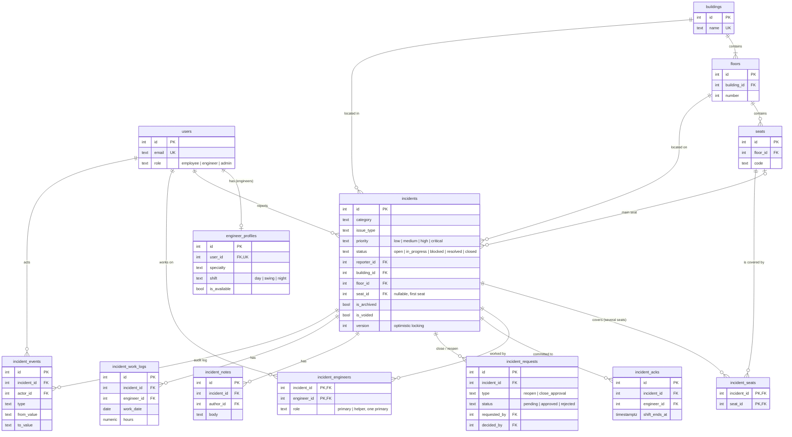

# ACME Facility Incident Management – Design

## 1. Stack & constraints
- Frontend: React (Vite, existing `frontend/`), Material UI, @mui/x-charts, react-router-dom, react-responsive, prop-types
- Backend: Python 3.13 Lambda services, one folder per service under `backend/` (`function.py` with `handler(event, context)` + `requirements.txt`), per `infra/locals.tf`
- DB: PostgreSQL via psycopg3. Dev = Supabase (Session pooler, sslmode=require). Cloud = Aurora (env vars injected by Terraform). Code reads only POSTGRES_HOST/PORT/NAME/USER/PASS (+ POSTGRES_SSLMODE).
- Auth: JWT (PyJWT) + bcrypt (used directly, NOT passlib). JWT_SECRET from env.
- Style (see .github/instructions): Python type hints, docstrings, PEP 8. React: PropTypes + JSDoc on all components, Airbnb style. Bandit runs on backend/: parameterized SQL only, no hardcoded secrets.
- API conventions: 201 create, 200 ok, 204 delete, 400 validation, 401 unauthenticated, 403 forbidden, 404 not found. Errors: {"error": str, "details": {}}.
- Gitignore gotchas: example env file must be `.env.sample`; never name folders assets/lib/build/tmp.

## 2. Services (names must not prefix each other; CloudFront routes /api/<name>*)
- backend/_shared/ : db.py (connect, create tables if not exist, seed if users empty), auth.py, http.py (parse_path strips optional /api/<service> prefix since local proxy strips it and cloud does not; response helpers), validation.py
- backend/auth/ : register (@acme.inc only, always role=employee), login, me
- backend/incidents/ : incidents, notes, work logs, status, priority, join, acknowledge, requests (reopen/close approval), void
- backend/facilities/ : buildings, floors, seats CRUD (admin only). Deleting a place with incidents -> 409; deleting an empty building/floor also deletes what is inside it, in one transaction
- backend/engineers/ : list with stats (admin + engineers), create/edit (admin creates engineer users), availability toggle (admin, or the engineer themselves). No delete: tickets, work logs and the audit log point at engineers, so an admin marks them unavailable instead
- backend/_shared/engineer_stats.py : the engineer workload query (incl. missed shift commitments), shared by dashboard and engineers so the definition lives in one place
- Approvals queue: GET /api/incidents/requests (admin) lists pending close approvals and reopen requests, oldest first
- backend/dashboard/ : role-specific metrics
- backend/dev_server.py : local HTTP server on :8000 mapping /api/<service>/... to that service's handler with a Lambda Function URL-style event (for local dev without LocalStack)
- Packaging: infra/lambda.tf zips backend/_shared into every Python service as `_shared/` (second `source_path` entry), so there are no copies to keep in sync. dev_server.py puts backend/ on sys.path instead.
- Secrets: JWT_SECRET and SEED_PASSWORD reach Lambdas via infra/locals.tf env_vars; from TF_VAR_jwt_secret / TF_VAR_seed_password if set, otherwise generated once by Terraform (`terraform output -raw seed_password`).
- bin/proxy-server.js forwards the Authorization header (needed by every authenticated route).

## 3. Roles
- employee: self-registers. admin: seeded. engineer: created by admin. "Supervisor" = admin.

## 4. Data model (13 tables)
```
users(id, name, email unique, password_hash, role employee|engineer|admin, created_at)
engineer_profiles(id, user_id, specialty facilities|IT|AV|security, shift day|swing|night, is_available, phone)
buildings(id, name, address) / floors(id, building_id, number) / seats(id, floor_id, code)
incidents(id, title, description, category, issue_type, priority low|medium|high|critical,
  status open|in_progress|blocked|resolved|closed, reporter_id, building_id, floor_id, seat_id NULL,
  blocked_reason, created_at, updated_at, acknowledged_at, assigned_at, resolved_at, closed_at,
  is_archived, archived_at, archived_by, is_voided, void_reason, voided_by)
incident_engineers(incident_id, engineer_id, role primary|helper, added_by, added_at)
incident_acks(id, incident_id, engineer_id, acknowledged_at, shift_ends_at)
incident_requests(id, incident_id, type reopen|close_approval, reason, status pending|approved|rejected,
  requested_by, requested_at, decided_by, decided_at, decision_note)
incident_notes(id, incident_id, author_id, body, created_at, edited_at)
incident_work_logs(id, incident_id, engineer_id, work_date, hours, description, created_at, edited_at)
incident_seats(incident_id, seat_id)  -- every seat of a report covering several seats; incidents.seat_id is the first
incident_events(id, incident_id, actor_id, type, from_value, to_value, reason, created_at)  -- audit log for EVERY change
```

### Entity relationship diagram

Key columns only; the list above has every column. GitHub renders this as a diagram.



## 5. Workflow (enforced in backend/incidents/rules.py, one dict)
```
open -> in_progress | blocked
in_progress -> blocked (reason required) | resolved (resolution note required)
blocked -> in_progress
resolved -> closed (reporter or admin) -> creates close_approval request
  admin approves -> is_archived = true (read-only, hidden from active lists)
  admin rejects (reason) -> back to resolved
resolved|closed (not archived) -> reporter submits reopen request (reason) -> admin approves -> in_progress
```
Nothing is hard-deleted. Admin can void an erroneous incident (reason) -> hidden from lists and metrics, kept in audit.

## 6. Business rules
- Priority: anyone reports low to high; only an admin can report critical (critical is shown site-wide) or change the priority later. Changes always log a priority_changed event (old, new, reason).
- Join: any engineer can join a non-archived ticket. If nobody has taken it, the engineer becomes primary ("Take this ticket"); if it is already taken, they join as a helper ("Join as helper"). The role is decided inside the INSERT and a partial unique index allows one primary per ticket, so two engineers taking it at the same moment give one primary and one helper. Logged. "Helped others" = count of helper rows.
- Assign / reassign: an admin makes an available engineer primary on an active ticket (`POST /api/incidents/{id}/assign`). The previous primary comes off the ticket, helpers stay, and an engineer_reassigned event records old -> new. The dialog suggests engineers by matching specialty, on shift now, then fewest active tickets. Fixes the dashboard's "needs reassignment" flag in the app.
- Acknowledge: engineer commits to handling it this shift. shift_ends_at computed from engineer shift (day 07-15, swing 15-23, night 23-07). Sets incidents.acknowledged_at on first ack.
- Missed shift commitment = shift_ends_at < now AND not resolved by shift_ends_at AND not moved to blocked (with reason) before shift_ends_at. Computed at query time.
- Notes: an admin or an engineer on the ticket can add, e.g. a repair note (an engineer who only has read access must join first; reporters don't add notes after reporting); shown with author name, role, timestamp. Only author edits; edits set edited_at and log old text to events. No deletion (append-only).
- Editing the report: an admin any time; the reporter only while the ticket is open and no request is pending. While a close approval or reopen request waits for an admin, the reporter can't change anything on the ticket.
- Work logs: only engineers on the ticket; hours in 0.25 steps, 0.25–12; work_date not in future and not before created_at; editable by author only (logged); locked once archived.
- Recurring issues: >= 3 incidents with same issue_type at same seat OR same floor within 30 days (constants). Shown on admin dashboard, as a badge on the incident, and as a warning on the create form (similar open incidents at the location).
  - Rule in `rules.recurring_level`: seat level if the seat alone reaches the threshold; floor level if the floor does across more than one seat. Voided incidents never count.
  - Windows: the dashboard and the create-form warning count the last 30 days; the badge on an incident counts incidents within 30 days before or after it, so every ticket in a pattern (including the first) is badged.
  - Several seats: the report form accepts `seat_ids` (up to 20, all on the chosen floor). The first becomes `incidents.seat_id`, so lists, the duplicate warning and recurring checks use it; every seat is stored in `incident_seats` and shown on the ticket.
  - Create form: `GET /api/incidents/similar?issue_type=&floor_id=&seat_id=` returns open duplicates and the recurring pattern. Employees get counts but only their own tickets (same privacy rule as Visibility); the recurring badge on an employee's ticket shows the count, not the related tickets.
- Shift stats: `on_shift_now` per engineer (`shifts.is_on_shift`), shift coverage on the admin dashboard (engineers / available / active tickets / missed per shift) and "My shift" on the engineer dashboard.
- Visibility: employee sees only incidents they reported (anyone else's returns 404, so employees can't find out what exists). Engineer sees all active (non-archived, non-voided) incidents read-only, because collaboration is a core requirement (we track how often engineers help each other), plus archived ones they worked on; they can only change incidents they're on (otherwise 403), and any engineer can join any active incident. Engineer list tabs: My tickets (default), Unassigned, All active. Admin sees all, including voided.
- Issue types (fixed list in code): IT: Wi-Fi, Monitor, Docking station, Printer, Badge reader. Facilities: HVAC, Lighting, Plumbing, Furniture, Cleaning. AV: Projector, Video conferencing, Speakers. Security: Door access, Camera, Lock.

## 7. Business questions -> features
- Open incidents & status -> status cards + pipeline, filterable list
- Recurring locations -> recurring issues panel, hotspots by building/floor/seat
- Ack/assign/resolve speed -> avg time KPIs from timestamps
- Engineer availability & distribution -> availability + workload, hours by engineer, helped-others, missed shift commitments
- Common issue types -> incidents by category/issue_type; avg hours by category
- Escalated/blocked & why -> "Needs attention": blocked (reason), priority raised by employees
- Employees informed -> time to first engineer note, % resolved with resolution note, reopen rate

## 8. Frontend
- src/services/api.js (VITE_API_URL, attaches token, one error handler), src/context/AuthContext.jsx
- components: Layout (AppBar + role-based drawer, hamburger on mobile), StatusChip, PriorityChip, WorkflowStepper (MUI Stepper, blocked in red, archived state), ConfirmDialog, EmptyState, RecurringBadge
- pages: Login, Register, Dashboard (per role), IncidentList (table on desktop / cards on mobile via react-responsive; search + filters), IncidentDetail (stepper, allowed actions only, tabs: Notes | Work log | History), IncidentForm (building->floor->seat cascade, category->issue_type, duplicate warning), Facilities, Engineers, Approvals (admin: close approvals + reopen requests)
- UX: loading states, Snackbar success/error, disable forms while submitting, field-level errors, hide actions the user can't perform.

## 9. Seed data
1 admin, 5 engineers (mixed shifts), ~10 employees, 3 buildings, ~40 seats, ~60 incidents over 30 days.
Intentional patterns: Seat 12-A-034 with 5 Wi-Fi incidents; one floor with 4 HVAC incidents on different seats; one overloaded engineer; one engineer with missed shift commitments; several blocked with reasons; pending close approvals + reopen requests.

## 10. Tests
- pytest: rules.py transitions, @acme.inc validation, role checks, parse_path, missed-shift logic, recurring detection.
- Vitest + React Testing Library: StatusChip, WorkflowStepper, Login error state.
- README: commands, results, known gaps.

## 11. Future improvements (README only, do not build)
Start/stop timer for work logs, email notifications, SSO, pagination, admin-managed issue types, self-service password reset.

## 12. Build order
1. _shared + DB schema + seed; verify tables in Supabase
2. auth service + dev_server.py; curl login works
3. incidents service core (CRUD, status, notes)
4. Frontend: Layout, Login/Register, IncidentList, IncidentDetail, IncidentForm   <- demo minimum
5. dashboard service + admin dashboard
6. priority / join / acknowledge / requests / void / work logs
7. facilities + engineers services and pages; Approvals page
8. Recurring issues + shift stats
9. Tests + README


## 13. Resilience, scalability & maintainability

### 13.1 Code structure (per service)
- `function.py` = routing only (method + path -> handler function)
- `service.py` = business logic and rules (no SQL, no HTTP)
- `repository.py` = SQL only (parameterized queries)
- `_shared/errors.py` = ValidationError(400), Unauthorized(401), Forbidden(403), NotFound(404), Conflict(409)
- One wrapper in `_shared/http.py` catches these and returns `{"error", "details"}` with the right status. Unexpected exceptions -> 500 with a generic message; full details logged only. Never return stack traces.

### 13.2 Data integrity
- Every multi-table write runs in ONE transaction (`with conn.transaction():`), e.g. status change + event row, close + approval request.
- DB constraints as second line of defense: NOT NULL, FOREIGN KEY, UNIQUE(email), CHECK for enums (status, priority, role, shift), CHECK(hours > 0 AND hours <= 12).
- Optimistic locking: `incidents.version INT`. Updates send the version they loaded; `UPDATE ... WHERE id = %s AND version = %s`, 0 rows -> 409 "This ticket was updated by someone else. Refresh to see the latest."
- All timestamps `TIMESTAMPTZ` stored in UTC. Shift times use one constant `ACME_TIMEZONE = "America/New_York"`; night shift (23-07) crosses midnight and must be tested.
- Indexes: incidents(status), incidents(reporter_id), incidents(building_id, floor_id, seat_id, issue_type, created_at), incident_engineers(engineer_id), incident_events(incident_id), incident_notes(incident_id), incident_work_logs(incident_id).

### 13.3 Input validation limits
- Strings are trimmed; empty after trim = missing. title <= 200, description <= 5000, note <= 2000, reason <= 1000 chars.
- Unknown fields in request bodies are rejected (400). Malformed JSON -> 400, not 500.
- Referenced IDs must exist AND be consistent (seat belongs to floor, floor belongs to building) -> 400.

### 13.4 Edge cases (each returns a clear error, usually 409)
- Changing an archived or voided incident -> 409.
- Reopen request while one is already pending -> 409. Same for close approval.
- Acknowledging the same ticket twice in the same shift -> returns existing ack (idempotent), no duplicate.
- Joining a ticket you're already on -> 200, no duplicate row.
- Priority "change" to the same value -> no-op, no event logged.
- Deleting a building/floor/seat that has incidents -> 409 (explain why). Delete otherwise OK.
- Engineer set unavailable while primary on open tickets -> allowed, but admin dashboard flags those tickets as "needs reassignment".
- Work log by an engineer no longer on the ticket -> 403.
- Registering an existing email -> 409. Login failure always says "Invalid email or password" (don't reveal which accounts exist).

### 13.5 Scalability
- Lambdas are stateless -> scale horizontally; DB connection reused per container and reset on failure (like `_examples`); `connect_timeout=10`, `statement_timeout=10s`.
- All list endpoints paginated: `?page=&page_size=` (default 25, max 100), response `{"items": [], "total": n, "page": p}`.
- Dashboard aggregates done in SQL (GROUP BY), never by loading rows into Python.

### 13.6 Auth resilience
- Access token lifetime 8h (one shift). `POST /api/auth/refresh` issues a new token while the current one is still valid; frontend refreshes when < 30 min remain.
- Expired/invalid token -> 401 with a clear message; frontend logs out and shows "Your session expired, please log in again."

### 13.7 Observability
- One structured JSON log line per request: request_id (Lambda `context.aws_request_id`), user_id, method, path, status, duration_ms. Errors logged with stack trace.
- `GET /api/auth/health` -> checks DB with `SELECT 1`, returns 200 or 503.

### 13.8 Frontend resilience
- `api.js` handles in one place: 401 -> logout + redirect; 403 -> "You don't have permission"; 409 -> show message + "Refresh" action; 400 -> map `details` to form fields; network error -> "Can't reach the server. Check your connection and try again."
- React ErrorBoundary around routes with a friendly fallback + "Reload" button.
- Every page has loading, empty and error states. Buttons disabled while requests are in flight (prevents double submits).

### 13.9 Tests for this section
- rules: every allowed and forbidden transition; missed-shift across midnight; recurring threshold boundaries (2 vs 3).
- API: 400/403/404/409 for the edge cases above; optimistic lock conflict.
- Frontend: api.js error mapping (401, 409, network error).

### 13.10 Production considerations (README only, not built)
RDS Proxy for connection pooling under high Lambda concurrency; rate limiting on login (API Gateway/WAF); Alembic migrations; retry with backoff for transient DB errors; caching dashboard queries; CloudWatch alarms on 5xx rate; refresh-token rotation.
